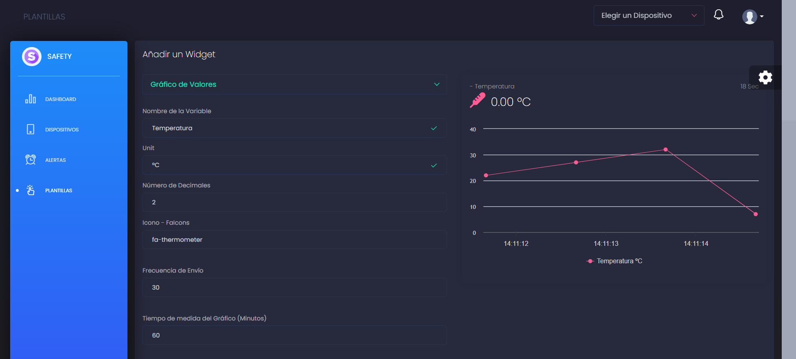

# Proyecto Safety: Módulo 4 IOT UEM

## Descripción

Safety es un proyecto de Internet de las Cosas (IoT) que integra sensores y actuadores en una plataforma fácil de usar. El proyecto incluye un dashboard personalizable con diferentes widgets para representar los valores de los sensores y actuadores, así como la configuración de alertas en tiempo real y la integración de dispositivos ESP32. Este proyecto ha sido desarrollado por el team leader DiegoK36 y el resto de integrantes del equipo.



## Características

- Integración de sensores y actuadores IoT.
- Dashboard personalizable con diferentes widgets para representar valores de sensores y actuadores.
- Configuración de alertas en tiempo real.
- Soporte para dispositivos ESP32.
- Desarrollado por el team leader DiegoK36 y el equipo del proyecto Safety.

## Requisitos

- Node.js v14.15.1 o superior (Hasta la v16.x.x).
- NPM v6.14.8 o superior.
- Un dispositivo ESP32 (opcional).

## Instalación

1. Clone este repositorio:

```bash
git clone https://github.com/DiegoK36/safety.git
```

2. Entre al directorio del proyecto:

```bash
cd safety
```

3. Instale las dependencias de proyecto:

```bash
npm install
```

4. Configure las variables de entorno en el archivo .env. Asegúrese de editar las variables según su configuración de hardware y red.

5. Inicie el servidor de desarrollo:

```bash
npm run dev
```

6. Abra su navegador web y visite http://localhost:3000 para acceder al dashboard.

## Uso de Aplicación

1. Configure sus dispositivos ESP32 a través del proyecto PlatformIO.

2. Utilice el dashboard para visualizar y monitorear los valores de los sensores y actuadores en tiempo real.

3. Configure las alertas en tiempo real a través de la interfaz de configuración de alertas en el dashboard.

4. Agrege nuevos dispositivos ESP32 en la aplicación y configurelos a su gusto en PlatformIO.

## Contribuciones

Si desea contribuir al proyecto, por favor, envíe un Pull Request con sus cambios y mejoras. Asegúrese de seguir las convenciones de código y de documentar adecuadamente sus contribuciones.

## Contacto

Si tiene alguna pregunta o necesita asistencia, no dude en ponerse en contacto con el team leader DiegoK36 a través de diegors.mail@gmail.com o cualquier otro miembro del equipo del proyecto Safety.
